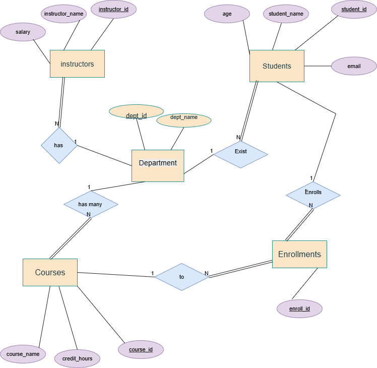
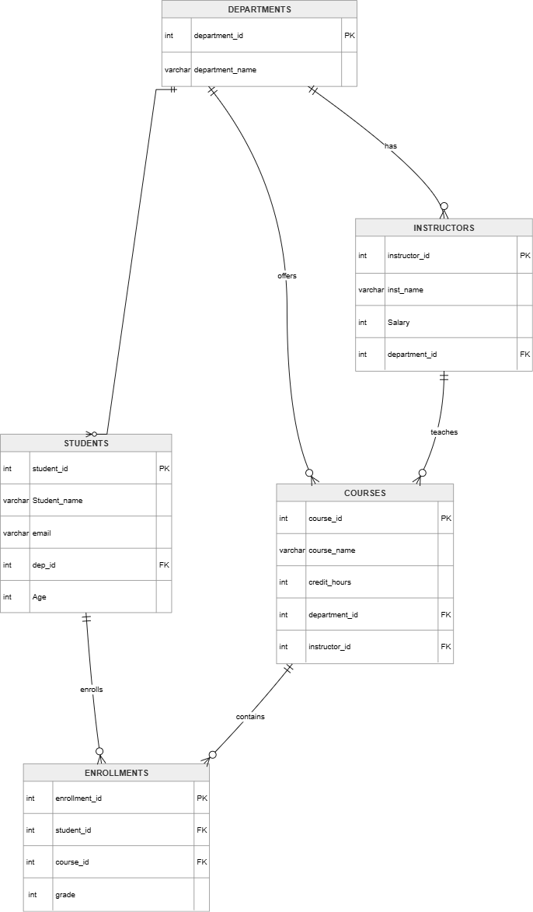

# University-Database-System
University Database System using Oracle SQL with ERD, relationships, views, triggers, and constraints.
# University Database System

A complete University Database System using Oracle SQL.

## Project Description
This project is designed to manage a university database system including:

- Students
- Instructors
- Courses
- Departments
- Enrollments

The project also includes:

- ERD Diagram
- Database Mapping
- SQL Tables
- Relationships
- Constraints
- Triggers
- Views

---

## Files Included

| File Name | Description |
|-----------|-------------|
| `University-Database_System.sql` | Main SQL script for database creation |
| `Project ERD.drawio` | ERD design of the database |
| `Mapping.drawio` | Database mapping diagram |

---

## Technologies Used

- Oracle SQL
- Draw.io
- Database Design Concepts

---

## Features

- Create and manage university database tables
- Apply primary and foreign keys
- Use constraints for data validation
- Create triggers and views
- Maintain relationships between entities

---

## ERD Diagram

## Mapping Diagram

## Author

Farouk Ahmed
